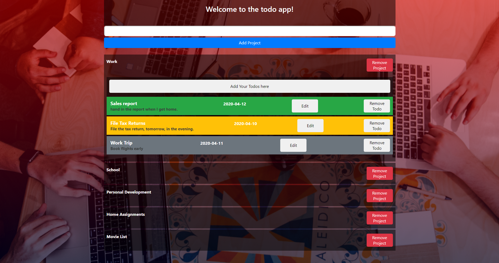

# todo-list

> Implementation of todo list with javascript dom-manipulation and es6 classes.



A summary description of the project and its features illustrated below.

## Built With

- Bootstrap,
- HTML/SASS,
- JavaScript,
- Webpack.

## Live Demo

[Live Demo Link](https://raw.githack.com/christianotieno/todo-list/feature/todo-list/dist/index.html
)

### Setup and installation

```
git clone git@github.com:christianotieno/todo-list.git
```

### Usage

```
npm install
```

> This action will install Webpack to the node_modules directory of this project.

### Run tests

```
npx eslint .
```

### Run the site

```
npm run watch
```

> This action will prepare your site and bundle everything together for you

## Authors

👤 **Christian Otieno**

- Github: [@christianotieno](https://github.com/christianotieno)
- Twitter: [@iamchrisotieno](https://twitter.com/iamchrisotieno)
- Linkedin: [Christian Otieno](https://linkedin.com/linkedinhandle)

👤 **Ermin Cahtarevic**

- Github: [@ermin-cahtarevic](https://github.com/ermin-cahtarevic)
- Twitter: [@ErminCahtarevic](https://twitter.com/ErminCahtarevic)
- Linkedin: [Ermin Cahtarevic](https://www.linkedin.com/in/ermincahtarevic/)

## 🤝 Contributing

Contributions, issues and feature requests are welcome!

Feel free to check the [issues page](https://github.com/christianotieno/todo-list/issues).

## Show your support

Give a ⭐️ if you like this project!

## Acknowledgments

- Hat tip to anyone who reviewed our code.

## 📝 License

This project is [MIT](https://opensource.org/licenses/MIT) licensed.
